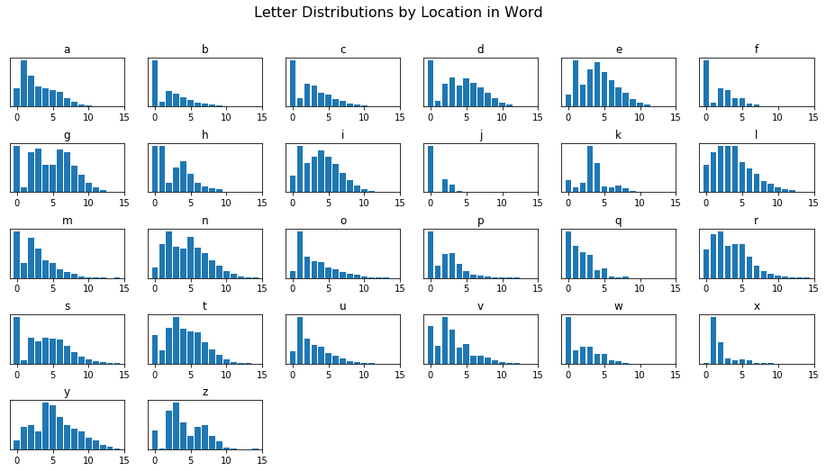
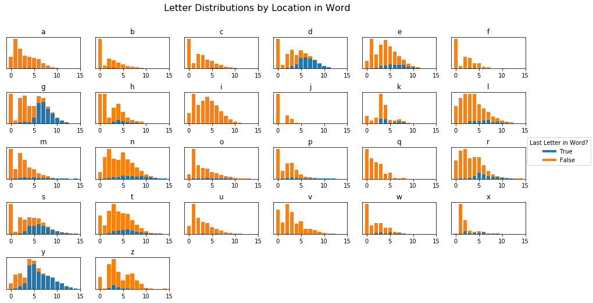

## The Data


```python
%pylab inline
import pandas as pd

from letterDist.helpers import load_all_words

words = load_all_words()
```

    Populating the interactive namespace from numpy and matplotlib
    

## [/u/polynomials](https://www.reddit.com/r/dataisbeautiful/comments/93owam/parsed_25322_of_the_most_common_english_words_to/e3exxrg/)

> These don't appear to be normalized for letter frequency. That would make it easier to evaluate visually how far into a word a letter tends to appear.

Let's start by getting our data the same as it was in the post.


```python
from letterDist.helpers import get_letter_dists, plot_letter_dists

dists = get_letter_dists(words, asFrame=True)
dists.head()
```


<div>
<style>
    .dataframe thead tr:only-child th {
        text-align: right;
    }

    .dataframe thead th {
        text-align: left;
    }

    .dataframe tbody tr th {
        vertical-align: top;
    }
</style>
<table border="1" class="dataframe">
  <thead>
    <tr style="text-align: right;">
      <th></th>
      <th>a</th>
      <th>b</th>
      <th>c</th>
      <th>d</th>
      <th>e</th>
      <th>f</th>
      <th>g</th>
      <th>h</th>
      <th>i</th>
      <th>j</th>
      <th>...</th>
      <th>q</th>
      <th>r</th>
      <th>s</th>
      <th>t</th>
      <th>u</th>
      <th>v</th>
      <th>w</th>
      <th>x</th>
      <th>y</th>
      <th>z</th>
    </tr>
  </thead>
  <tbody>
    <tr>
      <th>0</th>
      <td>1405.0</td>
      <td>1566.0</td>
      <td>2533.0</td>
      <td>1595.0</td>
      <td>988.0</td>
      <td>1198.0</td>
      <td>825.0</td>
      <td>1036.0</td>
      <td>915.0</td>
      <td>250.0</td>
      <td>...</td>
      <td>92.0</td>
      <td>1442.0</td>
      <td>3135.0</td>
      <td>1323.0</td>
      <td>499.0</td>
      <td>377.0</td>
      <td>728.0</td>
      <td>1.0</td>
      <td>98.0</td>
      <td>44.0</td>
    </tr>
    <tr>
      <th>1</th>
      <td>3554.0</td>
      <td>150.0</td>
      <td>438.0</td>
      <td>202.0</td>
      <td>3739.0</td>
      <td>91.0</td>
      <td>83.0</td>
      <td>1040.0</td>
      <td>2577.0</td>
      <td>4.0</td>
      <td>...</td>
      <td>64.0</td>
      <td>2227.0</td>
      <td>220.0</td>
      <td>624.0</td>
      <td>1914.0</td>
      <td>182.0</td>
      <td>208.0</td>
      <td>282.0</td>
      <td>238.0</td>
      <td>1.0</td>
    </tr>
    <tr>
      <th>2</th>
      <td>2368.0</td>
      <td>518.0</td>
      <td>1223.0</td>
      <td>793.0</td>
      <td>1784.0</td>
      <td>460.0</td>
      <td>703.0</td>
      <td>205.0</td>
      <td>1618.0</td>
      <td>70.0</td>
      <td>...</td>
      <td>51.0</td>
      <td>2364.0</td>
      <td>1737.0</td>
      <td>1645.0</td>
      <td>1006.0</td>
      <td>469.0</td>
      <td>257.0</td>
      <td>127.0</td>
      <td>259.0</td>
      <td>93.0</td>
    </tr>
    <tr>
      <th>3</th>
      <td>1506.0</td>
      <td>442.0</td>
      <td>1139.0</td>
      <td>1007.0</td>
      <td>3003.0</td>
      <td>429.0</td>
      <td>776.0</td>
      <td>558.0</td>
      <td>1937.0</td>
      <td>39.0</td>
      <td>...</td>
      <td>46.0</td>
      <td>1618.0</td>
      <td>1473.0</td>
      <td>2138.0</td>
      <td>762.0</td>
      <td>338.0</td>
      <td>258.0</td>
      <td>32.0</td>
      <td>192.0</td>
      <td>112.0</td>
    </tr>
    <tr>
      <th>4</th>
      <td>1371.0</td>
      <td>317.0</td>
      <td>729.0</td>
      <td>702.0</td>
      <td>3565.0</td>
      <td>206.0</td>
      <td>477.0</td>
      <td>699.0</td>
      <td>2296.0</td>
      <td>7.0</td>
      <td>...</td>
      <td>15.0</td>
      <td>1708.0</td>
      <td>1706.0</td>
      <td>1611.0</td>
      <td>705.0</td>
      <td>158.0</td>
      <td>147.0</td>
      <td>22.0</td>
      <td>498.0</td>
      <td>65.0</td>
    </tr>
  </tbody>
</table>
<p>5 rows × 26 columns</p>
</div>


Now we'll take each cell as a % of it's column


```python
normedDists = (dists / dists.sum())
normedDists.head()
```


<div>
<style>
    .dataframe thead tr:only-child th {
        text-align: right;
    }

    .dataframe thead th {
        text-align: left;
    }

    .dataframe tbody tr th {
        vertical-align: top;
    }
</style>
<table border="1" class="dataframe">
  <thead>
    <tr style="text-align: right;">
      <th></th>
      <th>a</th>
      <th>b</th>
      <th>c</th>
      <th>d</th>
      <th>e</th>
      <th>f</th>
      <th>g</th>
      <th>h</th>
      <th>i</th>
      <th>j</th>
      <th>...</th>
      <th>q</th>
      <th>r</th>
      <th>s</th>
      <th>t</th>
      <th>u</th>
      <th>v</th>
      <th>w</th>
      <th>x</th>
      <th>y</th>
      <th>z</th>
    </tr>
  </thead>
  <tbody>
    <tr>
      <th>0</th>
      <td>0.100890</td>
      <td>0.445519</td>
      <td>0.322757</td>
      <td>0.205913</td>
      <td>0.045585</td>
      <td>0.437865</td>
      <td>0.139736</td>
      <td>0.231147</td>
      <td>0.060138</td>
      <td>0.661376</td>
      <td>...</td>
      <td>0.313993</td>
      <td>0.106886</td>
      <td>0.214037</td>
      <td>0.104693</td>
      <td>0.082520</td>
      <td>0.187843</td>
      <td>0.393726</td>
      <td>0.001919</td>
      <td>0.031963</td>
      <td>0.085603</td>
    </tr>
    <tr>
      <th>1</th>
      <td>0.255206</td>
      <td>0.042674</td>
      <td>0.055810</td>
      <td>0.026078</td>
      <td>0.172511</td>
      <td>0.033260</td>
      <td>0.014058</td>
      <td>0.232039</td>
      <td>0.169372</td>
      <td>0.010582</td>
      <td>...</td>
      <td>0.218430</td>
      <td>0.165073</td>
      <td>0.015020</td>
      <td>0.049379</td>
      <td>0.316521</td>
      <td>0.090683</td>
      <td>0.112493</td>
      <td>0.541267</td>
      <td>0.077626</td>
      <td>0.001946</td>
    </tr>
    <tr>
      <th>2</th>
      <td>0.170042</td>
      <td>0.147368</td>
      <td>0.155836</td>
      <td>0.102375</td>
      <td>0.082311</td>
      <td>0.168129</td>
      <td>0.119072</td>
      <td>0.045739</td>
      <td>0.106342</td>
      <td>0.185185</td>
      <td>...</td>
      <td>0.174061</td>
      <td>0.175228</td>
      <td>0.118591</td>
      <td>0.130173</td>
      <td>0.166363</td>
      <td>0.233682</td>
      <td>0.138994</td>
      <td>0.243762</td>
      <td>0.084475</td>
      <td>0.180934</td>
    </tr>
    <tr>
      <th>3</th>
      <td>0.108143</td>
      <td>0.125747</td>
      <td>0.145133</td>
      <td>0.130003</td>
      <td>0.138553</td>
      <td>0.156798</td>
      <td>0.131436</td>
      <td>0.124498</td>
      <td>0.127309</td>
      <td>0.103175</td>
      <td>...</td>
      <td>0.156997</td>
      <td>0.119932</td>
      <td>0.100567</td>
      <td>0.169186</td>
      <td>0.126013</td>
      <td>0.168411</td>
      <td>0.139535</td>
      <td>0.061420</td>
      <td>0.062622</td>
      <td>0.217899</td>
    </tr>
    <tr>
      <th>4</th>
      <td>0.098449</td>
      <td>0.090185</td>
      <td>0.092890</td>
      <td>0.090627</td>
      <td>0.164483</td>
      <td>0.075292</td>
      <td>0.080793</td>
      <td>0.155957</td>
      <td>0.150904</td>
      <td>0.018519</td>
      <td>...</td>
      <td>0.051195</td>
      <td>0.126603</td>
      <td>0.116474</td>
      <td>0.127483</td>
      <td>0.116587</td>
      <td>0.078724</td>
      <td>0.079502</td>
      <td>0.042226</td>
      <td>0.162427</td>
      <td>0.126459</td>
    </tr>
  </tbody>
</table>
<p>5 rows × 26 columns</p>
</div>


Ensure they all sum to 1


```python
print(normedDists.sum().values)
```

    [ 1.  1.  1.  1.  1.  1.  1.  1.  1.  1.  1.  1.  1.  1.  1.  1.  1.  1.
      1.  1.  1.  1.  1.  1.  1.  1.]
    

And recreate the plot a bit cleaner


```python
plot_letter_dists(normedDists)
```





------

## [/u/itsallcauchy](https://www.reddit.com/r/dataisbeautiful/comments/93owam/parsed_25322_of_the_most_common_english_words_to/e3et2zn/?utm_content=permalink&utm_medium=front&utm_source=reddit&utm_name=dataisbeautiful)

> Could you add an extra slot on the far right of each that denotes the last letter? I feel like that would be super helpful for letters like g. Or maybe color code the vertical bar graphs for the portion of each nth letter where it is also the last letter? Just a thought.

This should be done in two steps:

1. Adjustment to the `get_letter_dists` function that parses all of the text to get last letters
2. Some GroupBy operation that jointly plots the two together

### 1. Get Endings

The function as it works now just gets letters in whichever spot


```python
dists = get_letter_dists(words, asFrame=True)
dists.head()
```


<div>
<style>
    .dataframe thead tr:only-child th {
        text-align: right;
    }

    .dataframe thead th {
        text-align: left;
    }

    .dataframe tbody tr th {
        vertical-align: top;
    }
</style>
<table border="1" class="dataframe">
  <thead>
    <tr style="text-align: right;">
      <th></th>
      <th>a</th>
      <th>b</th>
      <th>c</th>
      <th>d</th>
      <th>e</th>
      <th>f</th>
      <th>g</th>
      <th>h</th>
      <th>i</th>
      <th>j</th>
      <th>...</th>
      <th>q</th>
      <th>r</th>
      <th>s</th>
      <th>t</th>
      <th>u</th>
      <th>v</th>
      <th>w</th>
      <th>x</th>
      <th>y</th>
      <th>z</th>
    </tr>
  </thead>
  <tbody>
    <tr>
      <th>0</th>
      <td>1405.0</td>
      <td>1566.0</td>
      <td>2533.0</td>
      <td>1595.0</td>
      <td>988.0</td>
      <td>1198.0</td>
      <td>825.0</td>
      <td>1036.0</td>
      <td>915.0</td>
      <td>250.0</td>
      <td>...</td>
      <td>92.0</td>
      <td>1442.0</td>
      <td>3135.0</td>
      <td>1323.0</td>
      <td>499.0</td>
      <td>377.0</td>
      <td>728.0</td>
      <td>1.0</td>
      <td>98.0</td>
      <td>44.0</td>
    </tr>
    <tr>
      <th>1</th>
      <td>3554.0</td>
      <td>150.0</td>
      <td>438.0</td>
      <td>202.0</td>
      <td>3739.0</td>
      <td>91.0</td>
      <td>83.0</td>
      <td>1040.0</td>
      <td>2577.0</td>
      <td>4.0</td>
      <td>...</td>
      <td>64.0</td>
      <td>2227.0</td>
      <td>220.0</td>
      <td>624.0</td>
      <td>1914.0</td>
      <td>182.0</td>
      <td>208.0</td>
      <td>282.0</td>
      <td>238.0</td>
      <td>1.0</td>
    </tr>
    <tr>
      <th>2</th>
      <td>2368.0</td>
      <td>518.0</td>
      <td>1223.0</td>
      <td>793.0</td>
      <td>1784.0</td>
      <td>460.0</td>
      <td>703.0</td>
      <td>205.0</td>
      <td>1618.0</td>
      <td>70.0</td>
      <td>...</td>
      <td>51.0</td>
      <td>2364.0</td>
      <td>1737.0</td>
      <td>1645.0</td>
      <td>1006.0</td>
      <td>469.0</td>
      <td>257.0</td>
      <td>127.0</td>
      <td>259.0</td>
      <td>93.0</td>
    </tr>
    <tr>
      <th>3</th>
      <td>1506.0</td>
      <td>442.0</td>
      <td>1139.0</td>
      <td>1007.0</td>
      <td>3003.0</td>
      <td>429.0</td>
      <td>776.0</td>
      <td>558.0</td>
      <td>1937.0</td>
      <td>39.0</td>
      <td>...</td>
      <td>46.0</td>
      <td>1618.0</td>
      <td>1473.0</td>
      <td>2138.0</td>
      <td>762.0</td>
      <td>338.0</td>
      <td>258.0</td>
      <td>32.0</td>
      <td>192.0</td>
      <td>112.0</td>
    </tr>
    <tr>
      <th>4</th>
      <td>1371.0</td>
      <td>317.0</td>
      <td>729.0</td>
      <td>702.0</td>
      <td>3565.0</td>
      <td>206.0</td>
      <td>477.0</td>
      <td>699.0</td>
      <td>2296.0</td>
      <td>7.0</td>
      <td>...</td>
      <td>15.0</td>
      <td>1708.0</td>
      <td>1706.0</td>
      <td>1611.0</td>
      <td>705.0</td>
      <td>158.0</td>
      <td>147.0</td>
      <td>22.0</td>
      <td>498.0</td>
      <td>65.0</td>
    </tr>
  </tbody>
</table>
<p>5 rows × 26 columns</p>
</div>


So we want to write a similar function that will only count where a letter is at the end of a word


```python
def get_endings(corpus, asFrame=False):
    eachLetter = [chr(x+97) for x in range(26)]
    eachLetter = dict.fromkeys(eachLetter)
    
    for letter in eachLetter:
        eachLetter[letter] = {0:0}
        
    for word in corpus:
        lastIdx = len(word) - 1
        letter = word[lastIdx]
        eachLetter[letter][lastIdx] = eachLetter[letter].get(lastIdx, 0) + 1
            
    if asFrame:
        return pd.DataFrame(eachLetter).fillna(0)
    return eachLetter
```

Looks better


```python
endings = get_endings(words, asFrame=True)
endings.head()
```


<div>
<style>
    .dataframe thead tr:only-child th {
        text-align: right;
    }

    .dataframe thead th {
        text-align: left;
    }

    .dataframe tbody tr th {
        vertical-align: top;
    }
</style>
<table border="1" class="dataframe">
  <thead>
    <tr style="text-align: right;">
      <th></th>
      <th>a</th>
      <th>b</th>
      <th>c</th>
      <th>d</th>
      <th>e</th>
      <th>f</th>
      <th>g</th>
      <th>h</th>
      <th>i</th>
      <th>j</th>
      <th>...</th>
      <th>q</th>
      <th>r</th>
      <th>s</th>
      <th>t</th>
      <th>u</th>
      <th>v</th>
      <th>w</th>
      <th>x</th>
      <th>y</th>
      <th>z</th>
    </tr>
  </thead>
  <tbody>
    <tr>
      <th>0</th>
      <td>0.0</td>
      <td>0.0</td>
      <td>0.0</td>
      <td>0.0</td>
      <td>0.0</td>
      <td>0.0</td>
      <td>0.0</td>
      <td>0.0</td>
      <td>0.0</td>
      <td>0.0</td>
      <td>...</td>
      <td>0.0</td>
      <td>0.0</td>
      <td>0.0</td>
      <td>0.0</td>
      <td>0.0</td>
      <td>0.0</td>
      <td>0.0</td>
      <td>0.0</td>
      <td>0.0</td>
      <td>0.0</td>
    </tr>
    <tr>
      <th>1</th>
      <td>11.0</td>
      <td>0.0</td>
      <td>0.0</td>
      <td>4.0</td>
      <td>9.0</td>
      <td>2.0</td>
      <td>1.0</td>
      <td>5.0</td>
      <td>8.0</td>
      <td>0.0</td>
      <td>...</td>
      <td>0.0</td>
      <td>3.0</td>
      <td>5.0</td>
      <td>3.0</td>
      <td>2.0</td>
      <td>0.0</td>
      <td>2.0</td>
      <td>3.0</td>
      <td>4.0</td>
      <td>0.0</td>
    </tr>
    <tr>
      <th>2</th>
      <td>21.0</td>
      <td>32.0</td>
      <td>12.0</td>
      <td>46.0</td>
      <td>61.0</td>
      <td>5.0</td>
      <td>46.0</td>
      <td>17.0</td>
      <td>12.0</td>
      <td>1.0</td>
      <td>...</td>
      <td>0.0</td>
      <td>30.0</td>
      <td>37.0</td>
      <td>65.0</td>
      <td>3.0</td>
      <td>2.0</td>
      <td>28.0</td>
      <td>24.0</td>
      <td>45.0</td>
      <td>4.0</td>
    </tr>
    <tr>
      <th>3</th>
      <td>59.0</td>
      <td>33.0</td>
      <td>10.0</td>
      <td>125.0</td>
      <td>310.0</td>
      <td>37.0</td>
      <td>56.0</td>
      <td>61.0</td>
      <td>12.0</td>
      <td>1.0</td>
      <td>...</td>
      <td>0.0</td>
      <td>58.0</td>
      <td>306.0</td>
      <td>200.0</td>
      <td>12.0</td>
      <td>1.0</td>
      <td>37.0</td>
      <td>9.0</td>
      <td>95.0</td>
      <td>14.0</td>
    </tr>
    <tr>
      <th>4</th>
      <td>83.0</td>
      <td>10.0</td>
      <td>26.0</td>
      <td>222.0</td>
      <td>390.0</td>
      <td>25.0</td>
      <td>39.0</td>
      <td>131.0</td>
      <td>9.0</td>
      <td>0.0</td>
      <td>...</td>
      <td>0.0</td>
      <td>197.0</td>
      <td>801.0</td>
      <td>216.0</td>
      <td>2.0</td>
      <td>0.0</td>
      <td>13.0</td>
      <td>7.0</td>
      <td>392.0</td>
      <td>7.0</td>
    </tr>
  </tbody>
</table>
<p>5 rows × 26 columns</p>
</div>


Then we want a DataFrame that's everything *not* at the end of the letter


```python
notEndings = (dists - endings).fillna(0)
notEndings.head()
```


<div>
<style>
    .dataframe thead tr:only-child th {
        text-align: right;
    }

    .dataframe thead th {
        text-align: left;
    }

    .dataframe tbody tr th {
        vertical-align: top;
    }
</style>
<table border="1" class="dataframe">
  <thead>
    <tr style="text-align: right;">
      <th></th>
      <th>a</th>
      <th>b</th>
      <th>c</th>
      <th>d</th>
      <th>e</th>
      <th>f</th>
      <th>g</th>
      <th>h</th>
      <th>i</th>
      <th>j</th>
      <th>...</th>
      <th>q</th>
      <th>r</th>
      <th>s</th>
      <th>t</th>
      <th>u</th>
      <th>v</th>
      <th>w</th>
      <th>x</th>
      <th>y</th>
      <th>z</th>
    </tr>
  </thead>
  <tbody>
    <tr>
      <th>0</th>
      <td>1405.0</td>
      <td>1566.0</td>
      <td>2533.0</td>
      <td>1595.0</td>
      <td>988.0</td>
      <td>1198.0</td>
      <td>825.0</td>
      <td>1036.0</td>
      <td>915.0</td>
      <td>250.0</td>
      <td>...</td>
      <td>92.0</td>
      <td>1442.0</td>
      <td>3135.0</td>
      <td>1323.0</td>
      <td>499.0</td>
      <td>377.0</td>
      <td>728.0</td>
      <td>1.0</td>
      <td>98.0</td>
      <td>44.0</td>
    </tr>
    <tr>
      <th>1</th>
      <td>3543.0</td>
      <td>150.0</td>
      <td>438.0</td>
      <td>198.0</td>
      <td>3730.0</td>
      <td>89.0</td>
      <td>82.0</td>
      <td>1035.0</td>
      <td>2569.0</td>
      <td>4.0</td>
      <td>...</td>
      <td>64.0</td>
      <td>2224.0</td>
      <td>215.0</td>
      <td>621.0</td>
      <td>1912.0</td>
      <td>182.0</td>
      <td>206.0</td>
      <td>279.0</td>
      <td>234.0</td>
      <td>1.0</td>
    </tr>
    <tr>
      <th>2</th>
      <td>2347.0</td>
      <td>486.0</td>
      <td>1211.0</td>
      <td>747.0</td>
      <td>1723.0</td>
      <td>455.0</td>
      <td>657.0</td>
      <td>188.0</td>
      <td>1606.0</td>
      <td>69.0</td>
      <td>...</td>
      <td>51.0</td>
      <td>2334.0</td>
      <td>1700.0</td>
      <td>1580.0</td>
      <td>1003.0</td>
      <td>467.0</td>
      <td>229.0</td>
      <td>103.0</td>
      <td>214.0</td>
      <td>89.0</td>
    </tr>
    <tr>
      <th>3</th>
      <td>1447.0</td>
      <td>409.0</td>
      <td>1129.0</td>
      <td>882.0</td>
      <td>2693.0</td>
      <td>392.0</td>
      <td>720.0</td>
      <td>497.0</td>
      <td>1925.0</td>
      <td>38.0</td>
      <td>...</td>
      <td>46.0</td>
      <td>1560.0</td>
      <td>1167.0</td>
      <td>1938.0</td>
      <td>750.0</td>
      <td>337.0</td>
      <td>221.0</td>
      <td>23.0</td>
      <td>97.0</td>
      <td>98.0</td>
    </tr>
    <tr>
      <th>4</th>
      <td>1288.0</td>
      <td>307.0</td>
      <td>703.0</td>
      <td>480.0</td>
      <td>3175.0</td>
      <td>181.0</td>
      <td>438.0</td>
      <td>568.0</td>
      <td>2287.0</td>
      <td>7.0</td>
      <td>...</td>
      <td>15.0</td>
      <td>1511.0</td>
      <td>905.0</td>
      <td>1395.0</td>
      <td>703.0</td>
      <td>158.0</td>
      <td>134.0</td>
      <td>15.0</td>
      <td>106.0</td>
      <td>58.0</td>
    </tr>
  </tbody>
</table>
<p>5 rows × 26 columns</p>
</div>


And we'll roll them into one DataFrame


```python
merged = endings.join(notEndings, lsuffix='_endings')

merged.head()
```


<div>
<style>
    .dataframe thead tr:only-child th {
        text-align: right;
    }

    .dataframe thead th {
        text-align: left;
    }

    .dataframe tbody tr th {
        vertical-align: top;
    }
</style>
<table border="1" class="dataframe">
  <thead>
    <tr style="text-align: right;">
      <th></th>
      <th>a_endings</th>
      <th>b_endings</th>
      <th>c_endings</th>
      <th>d_endings</th>
      <th>e_endings</th>
      <th>f_endings</th>
      <th>g_endings</th>
      <th>h_endings</th>
      <th>i_endings</th>
      <th>j_endings</th>
      <th>...</th>
      <th>q</th>
      <th>r</th>
      <th>s</th>
      <th>t</th>
      <th>u</th>
      <th>v</th>
      <th>w</th>
      <th>x</th>
      <th>y</th>
      <th>z</th>
    </tr>
  </thead>
  <tbody>
    <tr>
      <th>0</th>
      <td>0.0</td>
      <td>0.0</td>
      <td>0.0</td>
      <td>0.0</td>
      <td>0.0</td>
      <td>0.0</td>
      <td>0.0</td>
      <td>0.0</td>
      <td>0.0</td>
      <td>0.0</td>
      <td>...</td>
      <td>92.0</td>
      <td>1442.0</td>
      <td>3135.0</td>
      <td>1323.0</td>
      <td>499.0</td>
      <td>377.0</td>
      <td>728.0</td>
      <td>1.0</td>
      <td>98.0</td>
      <td>44.0</td>
    </tr>
    <tr>
      <th>1</th>
      <td>11.0</td>
      <td>0.0</td>
      <td>0.0</td>
      <td>4.0</td>
      <td>9.0</td>
      <td>2.0</td>
      <td>1.0</td>
      <td>5.0</td>
      <td>8.0</td>
      <td>0.0</td>
      <td>...</td>
      <td>64.0</td>
      <td>2224.0</td>
      <td>215.0</td>
      <td>621.0</td>
      <td>1912.0</td>
      <td>182.0</td>
      <td>206.0</td>
      <td>279.0</td>
      <td>234.0</td>
      <td>1.0</td>
    </tr>
    <tr>
      <th>2</th>
      <td>21.0</td>
      <td>32.0</td>
      <td>12.0</td>
      <td>46.0</td>
      <td>61.0</td>
      <td>5.0</td>
      <td>46.0</td>
      <td>17.0</td>
      <td>12.0</td>
      <td>1.0</td>
      <td>...</td>
      <td>51.0</td>
      <td>2334.0</td>
      <td>1700.0</td>
      <td>1580.0</td>
      <td>1003.0</td>
      <td>467.0</td>
      <td>229.0</td>
      <td>103.0</td>
      <td>214.0</td>
      <td>89.0</td>
    </tr>
    <tr>
      <th>3</th>
      <td>59.0</td>
      <td>33.0</td>
      <td>10.0</td>
      <td>125.0</td>
      <td>310.0</td>
      <td>37.0</td>
      <td>56.0</td>
      <td>61.0</td>
      <td>12.0</td>
      <td>1.0</td>
      <td>...</td>
      <td>46.0</td>
      <td>1560.0</td>
      <td>1167.0</td>
      <td>1938.0</td>
      <td>750.0</td>
      <td>337.0</td>
      <td>221.0</td>
      <td>23.0</td>
      <td>97.0</td>
      <td>98.0</td>
    </tr>
    <tr>
      <th>4</th>
      <td>83.0</td>
      <td>10.0</td>
      <td>26.0</td>
      <td>222.0</td>
      <td>390.0</td>
      <td>25.0</td>
      <td>39.0</td>
      <td>131.0</td>
      <td>9.0</td>
      <td>0.0</td>
      <td>...</td>
      <td>15.0</td>
      <td>1511.0</td>
      <td>905.0</td>
      <td>1395.0</td>
      <td>703.0</td>
      <td>158.0</td>
      <td>134.0</td>
      <td>15.0</td>
      <td>106.0</td>
      <td>58.0</td>
    </tr>
  </tbody>
</table>
<p>5 rows × 52 columns</p>
</div>


### Make Plots

We'll probably want to make a `GroupBy` object. This lambda will group columns with the same starting letter

e.g. `a` and `a_endings`


```python
gb = merged.groupby(lambda x: x[0], axis=1)
```

And modify our plotting function to stack the two, as well as our legend creator to demarcate orange vs blue


```python
fig, axes = plt.subplots(5, 6, figsize=(16, 8))
for idx, (ax, group) in enumerate(zip(axes.flatten(), gb)):
    df = group[1]
    ax.bar(df.index, df.iloc[:, 0])
    ax.bar(df.index, df.iloc[:, 1], bottom=df.iloc[:, 0])
    ax.set_title(group[0])
    ax.set_xlim(-1, 15)
    ax.get_yaxis().set_visible(False)    
    
else:
    # clean up unused axes
    [ax.set_visible(False) for ax in axes.flatten()[idx+1:]]
plt.subplots_adjust(hspace=.75)
plt.suptitle('Letter Distributions by Location in Word',
                   fontsize=16)    


custom_lines = [Line2D([0], [0], color='C0', lw=4),
                Line2D([0], [0], color='C1', lw=4),]
fig.legend(custom_lines, ['True', 'False'],
           title='Last Letter in Word?', loc='right')
```


    <matplotlib.legend.Legend at 0xd25fb38>





```python
k
```
